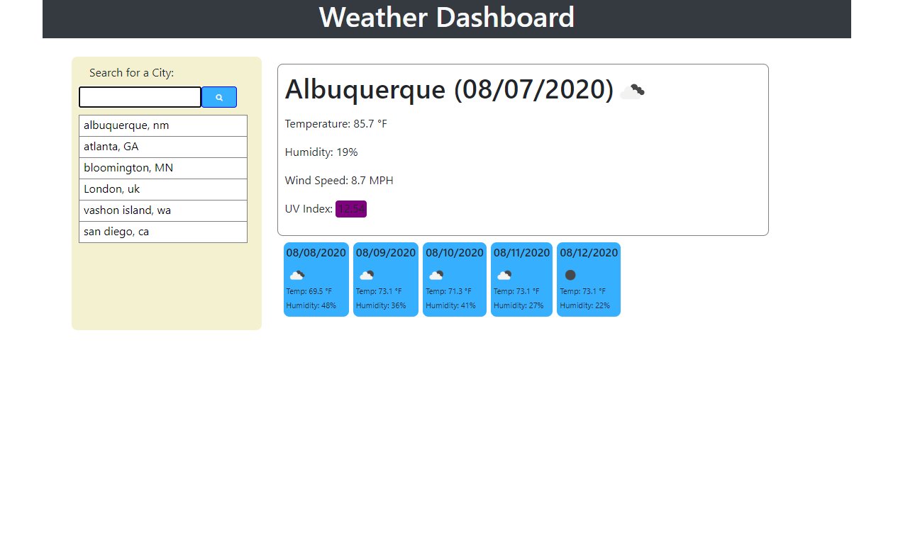

# Weather Dashboard
An API based simple weather information application.

https://rebgrasshopper.github.io/weatherstation/

Table of Contents:

- [Section 1: Introduction](#introduction)
- [Section 2: Usage](#usage)
- [Section 3: Credits](#credits)
- [Section 4: License](#license)

## Introduction ##

This project can be accessed from any browser on an internet-connected device. It uses a form to accept user input, and takes that information to query the openweathermap api with ajax. It uses three APIs from openweathermap: 
- Current weather: https://openweathermap.org/api
- UV Index: https://openweathermap.org/api/uvi
- 5 day forecast: https://openweathermap.org/forecast5
as well as dynamically updated html and css via jquery and javascript. A mix of bootstrap and raw css is used to make the application responsive.

## Usage ##

The source files for this quiz can be accessed through cloning the GitHub repo. The link above will take you to the deployed project.

## Credits ##

Thanks to my coding co-op, and you can catch some of 'em here:

- [Zachary Bryan](https://github.com/zacharybryan)
- [Tim Sanders](https://github.com/tbsanders5)
- [Nick Konzen](https://github.com/NTKonzen)
- [Kira Bismuth Lowrey](https://github.com/KILowrey)
- [Nancy Lambert-Brown](https://github.com/n-lambert)
- [Mando Estrada](https://github.com/Mando619)
- [Talia Vazquez](https://github.com/taliavazquez)
- [Perry Theobald](https://github.com/perrytjr)
- [Jeneth Diestra](https://github.com/jen6one9)
- [Matthew Rogers](https://github.com/Rogers-Development-Services)
- [Jefrrey Choi](https://github.com/jepoy92)
- [Clyde Baron Rapinan](https://github.com/clydebaron2000)
- [Johnny Lieu](https://github.com/johnnylieu)
- [Robert Graham](https://github.com/Robmgraham)

## License ##

GNU General Public License
